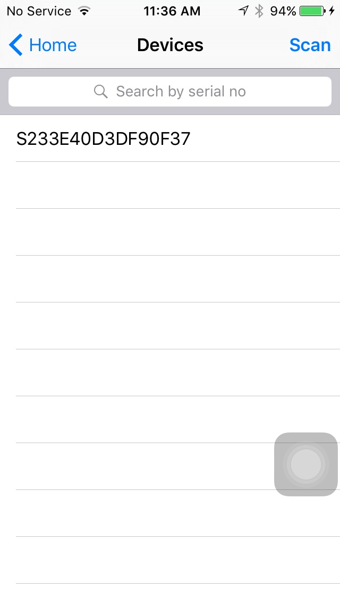
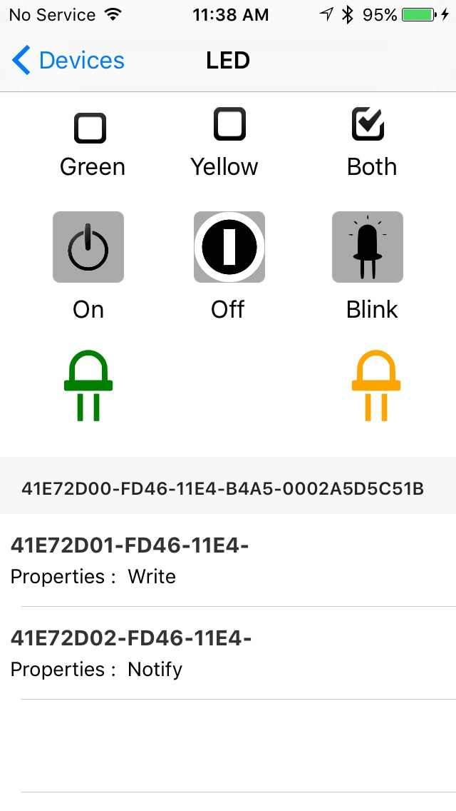

# SecuRemote Devkit-1 for Apple iOS

# Table of Contents

- [Prerequisites](#prerequisites)
- [Introduction](#introduction)
- [Examples](#examples)
- [SecuRemote Devkit-1](#SecuRemote Devkit-1)

## Prerequisites

* Mac computer with Xcode 7 and above.
* iPhone (4S or newer) or iPad (3rd generation or newer) to run the application.
* One or more SecuRemote Devkit-1.

## Introduction

A **SecuRemote Devkit-1** iOS provides a demo of both LED and Temperature sensor. If you know basics of iOS and Objective C then you can build your own Bluetooth 4.0 Low Energy (aka Smart or LE) app using iOS SDK.

**SecuRemote Devkit-1** iOS is built purely on Apple Core Bluetooth technologies and is 100 % Bluetooth Compatible.

Learn more:

- Go through [Bluetooth SIG](https://www.bluetooth.com/develop-with-bluetooth) to get knowledge of various Bluetooth Technologies.
- Go through [Apple Developer Bluetooth](https://developer.apple.com/bluetooth).
- Go through basic [Understanding Core Bluetooth](http://www.raywenderlich.com/52080/introduction-core-bluetooth-building-heart-rate-monitor)

 
## Examples

**SecuRemote Devkit-1** contains examples like Temperature, LED.

